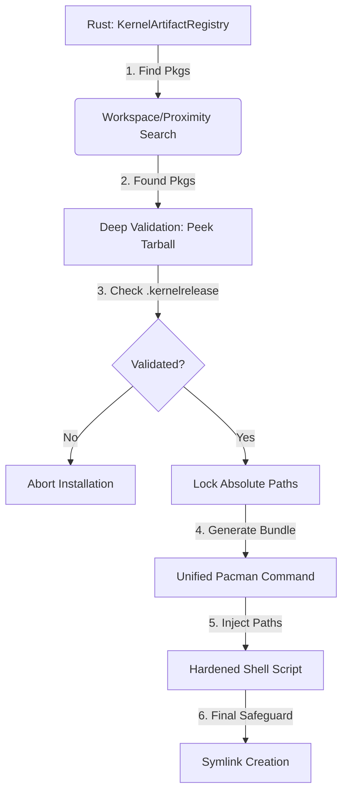

# BEST PRACTICE REGISTRY BLUEPRINT: Architectural Consolidation

**To**: Orchestrator  
**From**: Architect  
**Status**: DESIGN PHASE - Phase 20 Fix  

## 1. Source of Truth Consolidation (Rust-to-Shell)
Currently, `scripts/install.sh` uses naive shell heuristics to find headers. This is being eliminated. The Rust `KernelArtifactRegistry` will now be the **exclusive** authority for path discovery.

### 1.1 Path Injection Protocol
The Rust side will generate the installation command by injecting absolute, validated paths directly into the shell execution context.

**Current (Naive Heuristic):**
```bash
# Inside installer.sh
HEADERS_DIR=$(find /usr/src -name "linux-headers-*" | head -n 1) # BUGGY
```

**Proposed (Locked Injection):**
Rust will pass environment variables or arguments to the shell batch:
```bash
GOATD_KERNEL_PKG="/abs/path/to/linux-6.18.7-1-x86_64.pkg.tar.zst"
GOATD_HEADERS_PKG="/abs/path/to/linux-headers-6.18.7-1-x86_64.pkg.tar.zst"
GOATD_HEADERS_SRC="/usr/src/linux-6.18.7-1"
```

## 2. KernelArtifactRegistry: Manifest-First Refactor
The `KernelArtifactRegistry` (currently in `src/kernel/manager.rs:46`) is being refactored to use a "Manifest-First" validation approach.

### 2.1 Atomic Validation Workflow
Before the installer starts, the Registry will:
1. **Identify**: Find all 3 artifacts (Kernel, Headers, Docs).
2. **Peeking**: Use `tar -tf` to look inside the headers/docs packages.
3. **Internal Verification**: Verify that the `.kernelrelease` file inside the headers package EXACTLY matches the kernel release string of the main package.
4. **Locking**: Once validated, store the *absolute* paths. If validation fails, the registry returns an `Err`, halting the installation before `pacman` is ever invoked.

### 2.2 Refactored Registry Structure
```rust
pub struct KernelArtifactRegistry {
    pub kernel_pkg: PathBuf,
    pub headers_pkg: PathBuf, // Now mandatory for "Best Practice"
    pub docs_pkg: Option<PathBuf>,
    pub target_kernelrelease: String, // Extracted from main pkg or metadata
    pub is_locked: bool,
}
```

## 3. Shell Snippet Hardening
The dynamic symlink logic in the installer is being updated with a safety guard boundary.

### 3.1 Hardened Symlink Guard
Instead of blindly linking, the script will perform a final check using the path provided by Rust:

```bash
# Hardened Link Snippet
function goatd_safe_link() {
    local target="$1" # Passed from Rust: e.g. /usr/src/linux-6.18.7
    local link_point="/usr/lib/modules/$(uname -r)/build"
    
    if [[ -f "${target}/.kernelrelease" ]]; then
        local target_ver=$(cat "${target}/.kernelrelease")
        if [[ "${target_ver}" == "$(uname -r)" ]]; then
            ln -sf "${target}" "${link_point}"
        else
            echo "CRITICAL: Version mismatch! Target: ${target_ver}, Running: $(uname -r)"
            exit 1
        fi
    fi
}
```

## 4. Implementation Mermaid Diagram



## 5. Summary of Changes
- **Source of Truth**: Rust `KernelArtifactRegistry`.
- **Validation**: Internal tarball `.kernelrelease` check.
- **Safety**: Mandatory version matching in both Rust and final Shell snippet.
- **Reliability**: Elimination of `find` and `grep` in the installer script for path discovery.

---
**Approval Required**: Orchestrator, please review this blueprint. If approved, please switch to Code Mode for implementation of these changes in `src/kernel/manager.rs`, `src/ui/controller.rs`, and `scripts/install.sh`.
