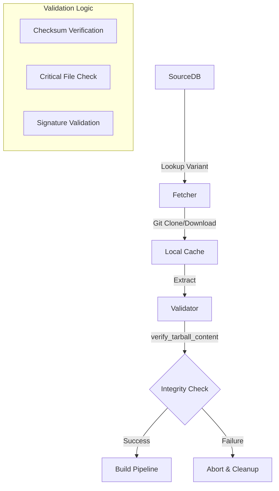
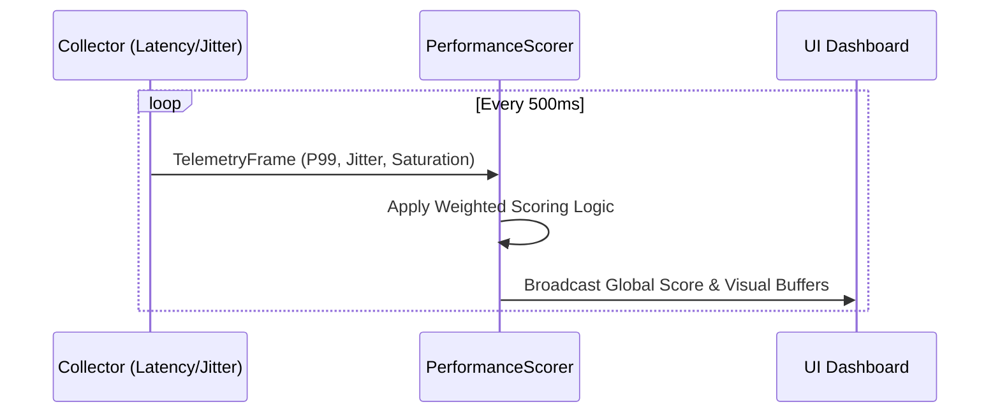
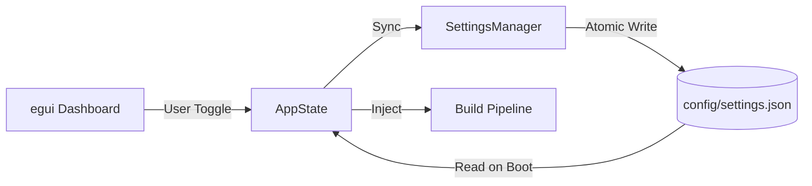
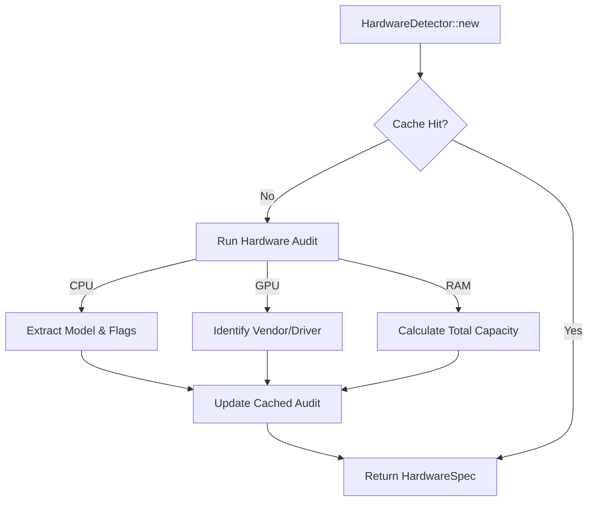

# GOATd Kernel Blueprint V2 (Technical Specification)

## 1. Project Vision
GOATd Kernel is a high-performance orchestration engine for Arch Linux, designed to bridge the gap between upstream kernel sources and hardware-specific optimizations. It provides a unified interface for kernel management, performance telemetry, and system-level tuning.

---

## 2. Kernel Orchestration Subsystem

### 2.1 Component Architecture
The Kernel Orchestration pipeline ensures that the correct sources are fetched, validated, and prepared for building with maximum integrity.

### 2.2 Technical Specs
- **SourceDB (`KernelSourceDB`)**: A centralized registry mapping kernel variants to their respective Git repositories and raw PKGBUILD URLs.
    - **Stable Path**: Standard Arch Linux `linux` and `linux-lts` variants.
    - **Hardened Path**: Security-focused `linux-hardened` with restricted attack surfaces.
    - **Bleeding-Edge Path**: `linux-mainline` (RC) for absolute upstream parity.
- **Verification Logic (`verify_tarball_content`)**:
    - Scans downloaded artifacts for critical files (headers, source tree).
    - Ensures the tarball structure matches expected kernel layouts before proceeding to the compiler.
    - Path: [`src/kernel/manager.rs`](src/kernel/manager.rs:294)

---

## 3. Performance Telemetry Subsystem

### 3.1 Data Flow
Continuous monitoring of system responsiveness using multi-threaded collectors and a scoring engine.

### 3.2 Technical Specs
- **`TelemetryFrame`**: The atomic unit of performance data.
    - `rolling_p99_us`: 99th percentile latency in microseconds.
    - `rolling_jitter_us`: Scheduler variance over 1000 samples.
    - `rolling_consistency_us`: Standard deviation of latency samples.
- **Collectors**:
    - `LatencyCollector`: Measures syscall and execution latency.
    - `MicroJitterCollector`: Tracks high-frequency scheduler timing deviations.
    - `SyscallSaturationCollector`: Monitors I/O and process wait times.

---

## 4. UI & Persistence Subsystem

### 4.1 State Management
The UI uses a reactive state pattern where user interactions are persisted to disk and synchronized with the build engine.

### 4.2 Technical Specs
- **`AppState`**: The "Source of Truth" for system configuration.
    - `selected_variant`: The active kernel flavor (`Stable`, `Hardened`, `LTS`, `Mainline`).
    - `kernel_hardening`: Hardening levels (Minimal, Standard, Hardened).
    - `use_polly/use_mglru`: Boolean flags for LLVM optimizations and memory management.
- **`SettingsManager`**: Handles serialization/deserialization of `AppState` using `serde_json` with thread-safe `RwLock` access.

---

## 5. Hardware Detection & Auditing

### 5.1 Logic Flow
Automated hardware auditing to ensure optimization flags match the physical CPU/GPU capabilities.

### 5.2 Technical Specs
- **`HardwareDetector`**:
    - `cached_cpu_model`: Caches output from `/proc/cpuinfo` or `lscpu`.
    - `cached_gpu_model`: Caches PCI IDs for GPU identification.
    - Ensures that `native_optimizations` in `AppState` are actually supported by the silicon.
    - Path: [`src/hardware/mod.rs`](src/hardware/mod.rs:52)

---

## 6. Logic Flow Implementation Mapping

| Phase | Feature | Source Implementation |
| :--- | :--- | :--- |
| **Prep** | Version Check | [`src/orchestrator/phases/prep.rs`](src/orchestrator/phases/prep.rs) |
| **Audit** | Hardware Probe | [`src/hardware/mod.rs`](src/hardware/mod.rs) |
| **Config** | AppState Sync | [`src/config/mod.rs`](src/config/mod.rs) |
| **Build** | PKGBUILD Gen | [`src/kernel/patcher/pkgbuild.rs`](src/kernel/patcher/pkgbuild.rs) |
| **Perf** | Telemetry Feed | [`src/system/performance/mod.rs`](src/system/performance/mod.rs) |

---
*Document Version: 0.2.1*
*Status: Locked Technical Source of Truth*
