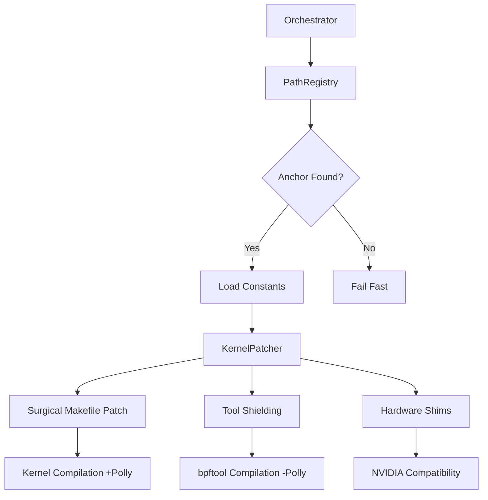

# MASTER BLUEPRINT: Workspace Overhaul & Build Pipeline Restoration
**Direct Report to: Orchestrator**
**Status: Architectural Design Phase (Complete)**

## 1. Executive Summary
This blueprint addresses the fragility of workspace resolution and the build failures associated with incorrect flag scoping (Clang/Polly). It establishes a "One Source of Truth" for paths and implements surgical scoping for optimization flags to protect tool builds while maximizing kernel performance.

## 2. Architectural Overhaul: Centralized Path Registry

### 2.1 The Anchor System
Transition from relative `parent()` discovery to mandatory anchor-based resolution.
- **The Anchor**: `.goatd_anchor` file at the true project root.
- **Validation**: Every operation requiring a path must first resolve the anchor.
- **Implementation**: Create `src/kernel/patcher/paths.rs` to house the `PathRegistry`.

### 2.2 Core Path Definitions
| Entity | Logic | Dependency |
|--------|-------|------------|
| `WORKSPACE_ROOT` | Resolved via `.goatd_anchor` | Mandatory |
| `SRC_DIR` | `WORKSPACE_ROOT/src/linux` (or variant) | Managed |
| `BUILD_DIR` | `WORKSPACE_ROOT/build` | Managed |
| `BACKUP_DIR` | `SRC_DIR/.goatd_backups` | Managed |

## 3. Build Flag Scoping Strategy

### 3.1 Problem: Polly Contamination
Build failures occur because `-polly` and other LLVM optimization flags are passed via `KCFLAGS` or `LDFLAGS` to tools like `bpftool`, which do not support or conflict with these optimizations.

### 3.2 Solution: Target-Specific Injection
Instead of global exports, we will inject flags directly into the kernel's top-level Makefile or specific sub-directories.

- **Global Makefile Patching**: 
  - Inject `GOATD_POLLY_FLAGS` into `KBUILD_CFLAGS` only when building the kernel core.
  - **Logic**: 
    ```makefile
    ifeq ($(MAKECMDGOALS),)
        # We are building the default target (kernel)
        KBUILD_CFLAGS += $(GOATD_POLLY_FLAGS)
    endif
    ```
- **Tool Shielding**:
  - Explicitly filter out optimization flags in `tools/` directory Makefiles.
  - Patch `tools/bpf/bpftool/Makefile` to strip `-polly` and `-flto`.

## 4. Header Integrity & Hardware Shims

### 4.1 Resilient Shims
Hardware-specific shims (like the NVIDIA `page_free` restoration) must be resilient to path changes.

- **Strategy**: Use the `PathRegistry` to locate `include/linux/memremap.h` regardless of whether the workspace is on the System NVME or an Optane scratch disk.
- **Verification**: Post-patching verification step in the pipeline to ensure the shim is present before `makepkg` starts.

## 5. Implementation Roadmap (Atomic Steps)

### Step 1: Path Registry Implementation
- [ ] Create `src/kernel/patcher/paths.rs`.
- [ ] Implement `resolve_workspace_root()` with anchor detection.
- [ ] Refactor `KernelPatcher` and `env.rs` to use `PathRegistry`.

### Step 2: Workspace Validation Gate
- [ ] Implement a pre-flight check in `executor.rs` that fails fast if `WORKSPACE_ROOT` is invalid.
- [ ] Ensure `GOATD_WORKSPACE_ROOT` is exported to all child processes (fakeroot, makepkg).

### Step 3: Surgical Flag Scoping
- [ ] Modify `src/kernel/patcher/pkgbuild.rs` to stop injecting Polly into global `CFLAGS`.
- [ ] Implement Makefile surgical patching in `src/kernel/patcher/mod.rs` to apply flags only to the kernel target.
- [ ] Create a `shield_tools()` method to strip flags from `tools/` subdirectories.

### Step 4: Infrastructure Hardening
- [ ] Update `HardwareContext` to trigger the `page_free` shim based on detected NVIDIA hardware.
- [ ] Add integration tests in `tests/workspace_resolution_test.rs`.

## 6. System Architecture Diagram



---
**Orchestrator, I am ready to proceed with Step 1 of this blueprint. This plan fixes the build-breaking flag contamination while establishing the path foundation required for Phase 2.**
