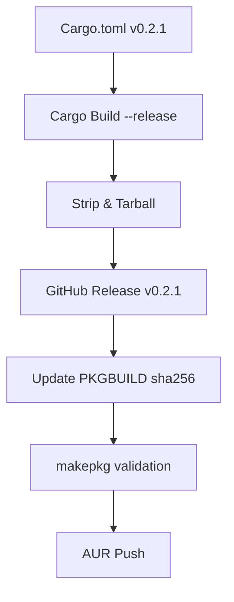

# MASTER BLUEPRINT: GOATd Kernel v0.2.1 Release

## Metadata
- **Project:** GOATd Kernel
- **Current Version:** 0.1.0
- **Target Version:** 0.2.1
- **Phase:** Release Engineering (Phase 1 Finalization)
- **Status:** Draft

---

## 🏗️ Phase 1: Local Environment Preparation & Versioning
**Goal:** Prepare the codebase for release by finalizing the version bump and ensuring a clean state.

1. **Workspace Audit:** Verify no uncommitted changes in the local repository.
2. **Version Bump:**
    - Update `version = "0.2.1"` in [`Cargo.toml`](Cargo.toml).
    - Run `cargo check` to update `Cargo.lock`.
3. **Commit Version Change:**
    - `git add Cargo.toml Cargo.lock`
    - `git commit -m "chore: bump version to 0.2.1"`

---

## 🛠️ Phase 2: Compilation, Optimization & Artifact Generation
**Goal:** Produce the production-ready binary using the LLVM-first toolchain and strip it for release.

1. **Release Build:**
    - Execute optimized build: `cargo build --release`.
2. **Binary Stripping:**
    - Strip debug symbols: `strip target/release/goatd_kernel`.
3. **Artifact Packaging:**
    - Create release tarball: `tar -czvf goatdkernel-0.2.1-x86_64.tar.gz -C target/release goatd_kernel`.
4. **Checksum Generation:**
    - Generate SHA256: `sha256sum goatdkernel-0.2.1-x86_64.tar.gz > goatdkernel-0.2.1-x86_64.tar.gz.sha256`.

---

## 🚀 Phase 3: GitHub Release & Tagging
**Goal:** Establish the source of truth for the binary and source on GitHub.

1. **Git Tagging:**
    - Create annotated tag: `git tag -a v0.2.1 -m "Release v0.2.1 - GOATd Kernel Builder"`.
    - Push tag to remote: `git push origin v0.2.1`.
2. **Release Creation:**
    - Create a GitHub Release via UI or CLI (`gh release create v0.2.1`).
    - Upload `goatdkernel-0.2.1-x86_64.tar.gz`.
    - Upload `goatdkernel-0.2.1-x86_64.tar.gz.sha256`.

---

## 📦 Phase 4: AUR Workspace & PKGBUILD Generation
**Goal:** Prepare the Arch User Repository package for `goatdkernel-bin`.

1. **AUR Clone:**
    - `git clone ssh://aur@aur.archlinux.org/goatdkernel-bin.git /tmp/goatdkernel-bin` (or specified AUR path).
2. **PKGBUILD Update:**
    - Copy template from [`pkgbuilds/binary/PKGBUILD`](pkgbuilds/binary/PKGBUILD).
    - Update `pkgver=0.2.1`.
    - Inject SHA256 sum from the generated checksum file into the `sha256sums` array.
3. **Metadata Generation:**
    - Run `makepkg --printsrcinfo > .SRCINFO`.

---

## 🧪 Phase 5: Validation & Integrity Audit
**Goal:** Ensure the package installs and runs correctly before public submission.

1. **Build Test:**
    - Run `makepkg -s` in the AUR directory to verify the download and build process.
2. **Installation Test:**
    - Verify binary placement: `ls -l /usr/bin/goatd_kernel` (post-install).
    - Execution check: `goatd_kernel --version`.
3. **Integrity Audit:** Verify binary matches the expected release checksum.

---

## 🏁 Phase 6: AUR Submission
**Goal:** Finalize the release on the AUR.

1. **Commit & Push:**
    - `git add PKGBUILD .SRCINFO`
    - `git commit -m "Update to v0.2.1"`
    - `git push origin master`

---

## 🗺️ Workflow Diagram

## 📋 Completion Checklist
- [ ] `Cargo.toml` version matches `v0.2.1`.
- [ ] Binary is stripped and smaller than debug build.
- [ ] GitHub Asset is downloadable.
- [ ] `PKGBUILD` `source` points to the correct GitHub Tag/Release.
- [ ] `.SRCINFO` is synchronized with `PKGBUILD`.
- [ ] AUR package version is updated.
