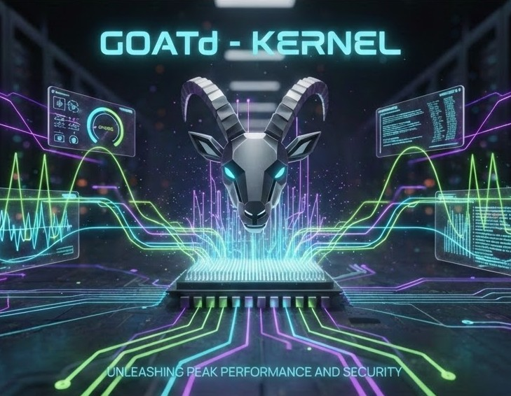

<p align="center">
  
  
  
  
</p>

# GOATd Kernel

---

> **The Precision Orchestrator for Linux Kernel Sovereignty.**
> Built for power users who demand total control over their kernel lifecycle, GOATd Kernel transforms complex optimization into a streamlined, high-performance workflow.

---

### Core Features

* 🛠️ **Orchestrator Build Pipeline**: State-aware engine for automated dependency resolution and microarchitecture detection.
* 📊 **Spectrum UI Telemetry**: Real-time monitoring of context switches, jitter, and syscall latency via native `egui`.
* ⚙️ **LLVM-First Toolchain**: Advanced LTO and Bolt optimization passes for maximum binary efficiency.
* 🛡️ **Integrity Audit**: Automated verification of source signatures and build environment health.

---

### Variant Matrix

| Variant | Focus | Description |
| :--- | :--- | :--- |
| **Mainline** | Edge | Latest upstream RC code with full pipeline support. |
| **Stable** | Balanced | Upstream standard with GOATd optimization passes. |
| **Hardened** | Security | Maximum attack surface reduction and hardening. |
| **LTS** | Reliability | Stability-first approach for mission-critical systems. |

---

### Quick Start

**1. Prerequisites**
Ensure you are on Arch Linux with base development tools:
```bash
sudo pacman -Syu --needed base-devel rustup git
rustup default stable
```

**2. Installation**
Clone and initialize the environment:
```bash
git clone https://github.com/madgoat/goatd-kernel.git
cd goatd-kernel
./goatdkernel.sh --setup
```

**3. Launch**
Run the orchestrator:
```bash
cargo run --release
```

---

### Architecture & Documentation

Explore the internal logic and design principles:
* [MPL Architecture](docs/MPL_ARCHITECTURE.md)
* [Kernel Profiles](docs/KERNEL_PROFILES.md)
* [Performance Metrics Spec](docs/PERFORMANCE_METRICS_SPEC.md)
* [User Guide](docs/USER_GUIDE.md)

---

*GOATd Kernel: Built for those who know the difference.*
