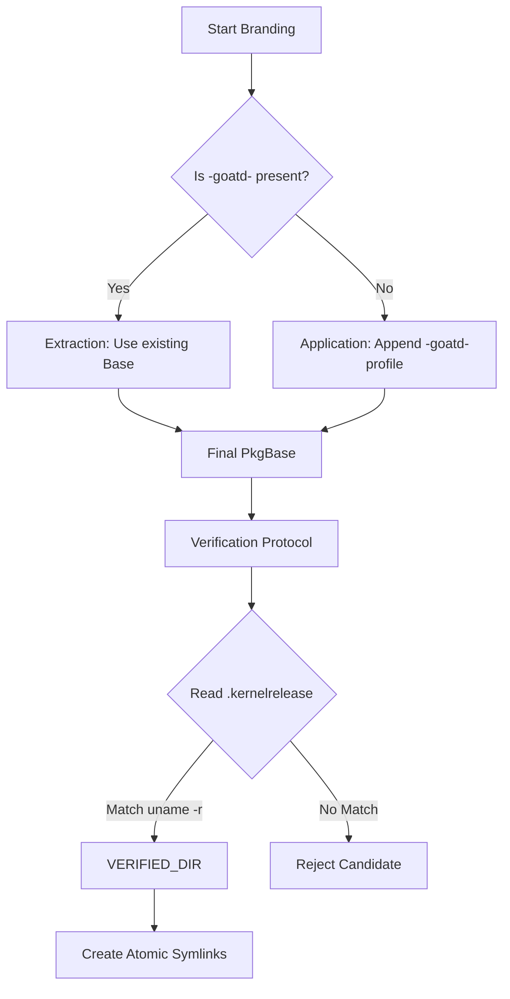

# UNIFIED NAMING BLUEPRINT: Resilient Branding & Verification

## TO: Orchestrator
## FROM: Architect
## SUBJECT: Design Specification for Kernel/Header Synchronization

This blueprint addresses the "double-branding" defect and loose header discovery heuristics identified in Phase 8. It establishes a strict, idempotent architecture for kernel naming and post-install verification.

---

## 1. Idempotent Branding Strategy
**Target**: [`src/kernel/patcher/pkgbuild.rs`](src/kernel/patcher/pkgbuild.rs)

### 1.1 Suffix-Aware `detect_kernel_variant`
The current `detect_kernel_variant` regex successfully strips `-goatd-*` but can be improved to prioritize terminal base names.

**Refinement**:
- Modify `PKGBASE_REGEX` to strictly anchor the variant capture, ensuring that if a string already contains `-goatd-`, the prefix is treated as the *immutable base*.
- **Logic**: If `pkgbase` contains `-goatd-`, the part *before* the first occurrence of `-goatd-` is the `variant`.

### 1.2 "Branding Lock" in `patch_pkgbuild_for_rebranding`
The current idempotency check only looks at `pkgbase`. We must extend this to array elements and function names.

**Mechanism**:
- **Atomic Search/Replace**: Before applying any branding, scan the file for the pattern `[^\n'"]+-goatd-[^\n'"]+`. If found in `pkgname` or `package_` functions, abort rebranding or "re-base" the naming logic to prevent `linux-zen-goatd-gaming-goatd-gaming`.
- **Logic**:
  ```rust
  let master_identity = if variant.contains("-goatd-") {
      variant.to_string() // Already branded, do not append again
  } else {
      format!("{}-goatd-{}", variant, profile)
  };
  ```

---

## 2. Strict Version Verification Protocol
**Target**: [`src/system/verification.rs`](src/system/verification.rs)

### 2.1 Direct `.kernelrelease` Validation
Loose heuristics (Strategy 3 in `discover_kernel_headers`) currently accept directories based on naming. We will mandate internal metadata verification.

**Protocol**:
1. Iterate through `/usr/src/linux-*`.
2. For each candidate, attempt to read `<candidate>/.kernelrelease`.
3. If `.kernelrelease` is missing, check `include/config/kernel.release` (fallback for some build systems).
4. **Hard Match**: The candidate is ONLY valid if the content of `.kernelrelease` matches `uname -r` (or the targeted `kernel_version`) **exactly**.
5. **Rebrand-Awareness**: If it matches `uname -r`, it is the "Verified Source", regardless of whether the directory name is `linux-6.18.7` or `linux-goatd-mainline`.

### 2.2 Rejection of "Loose" Matches
- Remove Strategy 2 (Base version fallback) from `discover_kernel_headers` unless the `.kernelrelease` inside that base directory matches the full running version.
- **Why**: Prevents a 6.18.7 kernel from using 6.19.0 headers just because they both start with `linux-`.

---

## 3. Unified Symlink Strategy
**Target**: [`src/system/verification.rs`](src/system/verification.rs:631)

### 3.1 The "Source of Truth" Symlink
Symlink creation in `create_kernel_symlinks_fallback` will be coupled to the Strict Protocol.

**Workflow**:
1. **Identify**: Get running kernel version via `uname -r`.
2. **Scan**: Run the Strict Protocol against `/usr/src`.
3. **Validate**: If a directory passes the `.kernelrelease` check, it is the `STRICT_PATH`.
4. **Purge**: If `build` or `source` symlinks exist but point elsewhere, `unlink` them immediately.
5. **Link**: Create symlinks pointing to `STRICT_PATH`.

### 3.2 Post-Install Hook Synchronization
The `.install` file generated in `src/kernel/patcher/pkgbuild.rs:2227` must be updated to use the same logic.

**Updated `.install` Logic**:
```bash
# Inside the shell hook
CURRENT_VER=$(uname -r)
for candidate in /usr/src/linux-*; do
    if [ -f "$candidate/.kernelrelease" ]; then
        VER=$(cat "$candidate/.kernelrelease")
        if [ "$VER" == "$CURRENT_VER" ]; then
            ln -sf "$candidate" "/usr/lib/modules/$CURRENT_VER/build"
            ln -sf "$candidate" "/usr/lib/modules/$CURRENT_VER/source"
            exit 0
        fi
    fi
done
```

---

## 4. Implementation Mermaid Diagram



## 5. Summary of Key Files for Delegation
- [`src/kernel/patcher/pkgbuild.rs`](src/kernel/patcher/pkgbuild.rs): Fix `detect_kernel_variant` and `patch_pkgbuild_for_rebranding`.
- [`src/system/verification.rs`](src/system/verification.rs): Overhaul `discover_kernel_headers` for `.kernelrelease` priority.
- [`src/kernel/patcher/templates.rs`](src/kernel/patcher/templates.rs): Update `MODULE_REPAIR_INSTALL` shell script.

This architecture ensures that branding is a one-time operation and discovery is anchored in the binary's reported version, not folder naming conventions.
