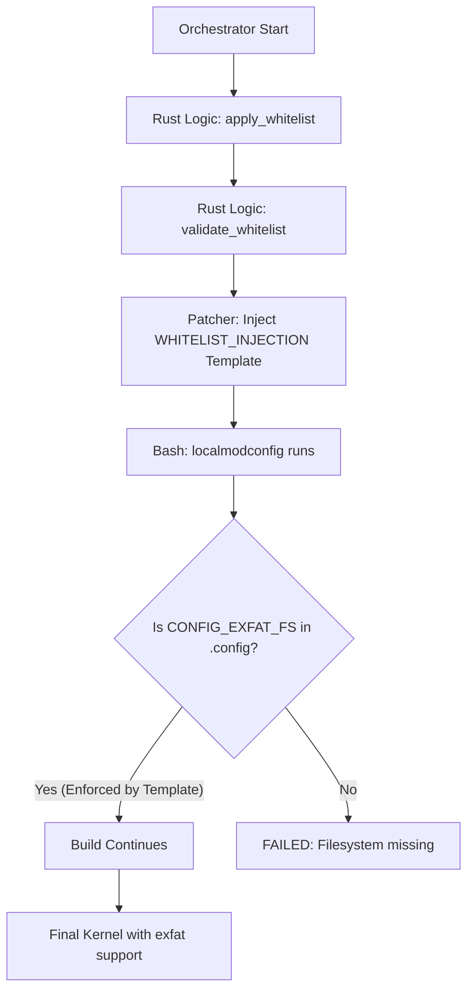

# WHITELIST_FIX_BLUEPRINT.md

## TO: Orchestrator
## FROM: Architect

### OBJECTIVE
Fix the missing `exfat` whitelist enforcement in the kernel build pipe by updating the `WHITELIST_INJECTION` template and proposing a synchronization mechanism between Rust-side safety logic and Bash-side build enforcement.

### 1. Template Updates
The `WHITELIST_INJECTION` template in [`src/kernel/patcher/templates.rs`](src/kernel/patcher/templates.rs) must be updated to include `exfat` and its critical dependencies to prevent `localmodconfig` from stripping them.

**Required Additions:**
- `CONFIG_EXFAT_FS=m`
- `CONFIG_EXFAT_DEFAULT_IOCHARSET="utf8"` (Critical for resiliency)
- `CONFIG_NLS_UTF8=m` (Required by exfat)
- `CONFIG_NLS_ISO8859_1=m` (Standard fallback)

#### Proposed Template Change (Fragment):
```bash
# Primary filesystems (MANDATORY)
CONFIG_EXT4_FS=y
CONFIG_BTRFS_FS=y

# Additional filesystems for bootability and compatibility (CRITICAL)
CONFIG_FAT_FS=m
CONFIG_VFAT_FS=m
CONFIG_EXFAT_FS=m
CONFIG_EXFAT_DEFAULT_IOCHARSET="utf8"
CONFIG_ISO9660=m
CONFIG_CIFS=m

# NLS (National Language Support) for EFI and ExFAT mounting (CRITICAL)
CONFIG_NLS_ASCII=m
CONFIG_NLS_CP437=m
CONFIG_NLS_ISO8859_1=m
CONFIG_NLS_UTF8=m
```

### 2. Dynamic Enforcement vs. Manual Synchronization
The current architecture uses a hardcoded `ESSENTIAL_DRIVERS` array in [`src/config/whitelist.rs`](src/config/whitelist.rs:67) and a separate hardcoded Bash template in [`src/kernel/patcher/templates.rs`](src/kernel/patcher/templates.rs:869).

**Analysis:**
- **Dynamic Generation**: Theoretically superior for "Single Source of Truth." However, Bash templates often require specific Kconfig syntax (e.g., `=y` vs `=m`, default values like `"utf8"`) that the simple string list of drivers in Rust doesn't capture.
- **Manual Synchronization**: Currently chosen for simplicity and surgical precision in the Bash script.

**Recommendation:**
Maintain **Manual Synchronization** for the Bash template to allow for the specific `CONFIG_EXFAT_DEFAULT_IOCHARSET` injection, but update [`src/config/whitelist.rs`](src/config/whitelist.rs) with "CANONICAL TRUTH" comments that explicitly reference the need to update the templates when the array changes.

### 3. Implementation Plan (for Code Mode)

#### Step 1: Update `src/kernel/patcher/templates.rs`
- Add `CONFIG_EXFAT_FS=m`
- Add `CONFIG_EXFAT_DEFAULT_IOCHARSET="utf8"`
- Add `CONFIG_NLS_UTF8=m`
- Add `CONFIG_NLS_ISO8859_1=m`

#### Step 2: Update `src/config/whitelist.rs`
- Ensure `nls_utf8` is added to the `ESSENTIAL_DRIVERS` array to allow the validation logic to protect it.
- Update documentation comments to link the two files.

#### Step 3: Verification
- Run existing tests in [`src/kernel/patcher/tests.rs`](src/kernel/patcher/tests.rs) (if they exist for whitelist injection).
- Verify that `localmodconfig` does not strip `exfat` when the patched PKGBUILD is used.

### 4. Mermaid Workflow



### 5. Resiliency Note
By setting `CONFIG_EXFAT_DEFAULT_IOCHARSET="utf8"` directly in the template, we ensure that even if the user has an unusual environment, the kernel defaults to the most compatible state for modern exfat volumes.
