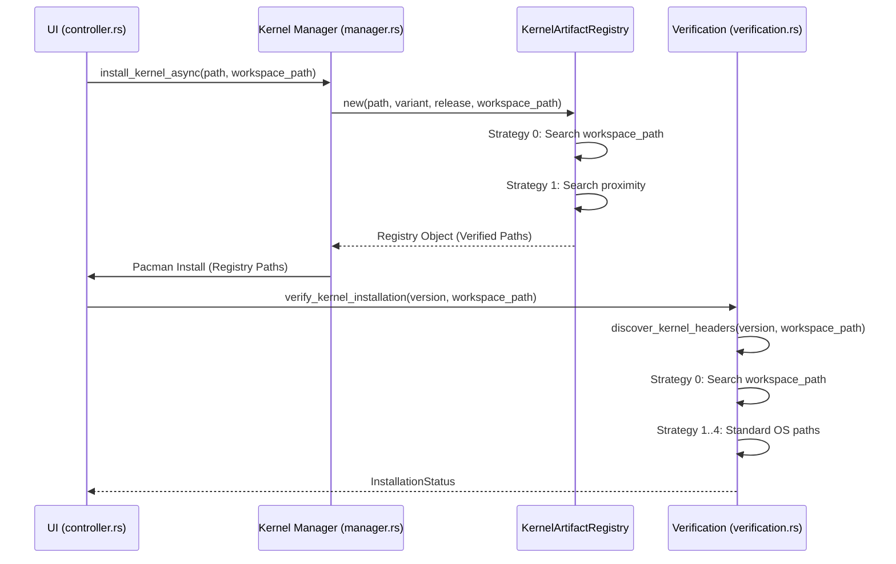

# Workspace-Centric Discovery & Verification Blueprint

## 1. Overview
The goal of this design is to unify workspace selection with kernel discovery and verification. Previous phases revealed that `KernelArtifactRegistry` and `src/system/verification.rs` were largely "Workspace-Blind," occasionally picking up system-wide headers instead of those built within the active workspace.

## 2. Component Design

### 2.1 Workspace-Aware Registry (`src/kernel/manager.rs`)
The `KernelArtifactRegistry` will be updated to accept an explicit `workspace_root`.

#### Interface Changes:
```rust
impl KernelArtifactRegistry {
    pub fn new(
        kernel_path: PathBuf,
        kernel_variant: String,
        kernel_release: String,
        workspace_root: Option<PathBuf>, // NEW: Explicit workspace context
    ) -> Result<Self, String>;
}
```

#### Selection Priority:
1. **Strategy 0 (Highest)**: Search for related artifacts (headers/docs) in the provided `workspace_root`.
2. **Strategy 1**: Search in the same directory as the `kernel_path` (Proximity-First).
3. **Strategy 2**: Standard heuristic permutations within the proximity directory.

### 2.2 Contextual Verification (`src/system/verification.rs`)
The `discover_kernel_headers` function is the primary discovery mechanism during post-install verification and symlink repair. It must prioritize the workspace that produced the kernel.

#### Interface Changes:
```rust
pub fn discover_kernel_headers(
    kernel_version: &str,
    workspace_path: Option<&Path>, // NEW: Priority search location
) -> Option<PathBuf>;
```

#### New Strategy 0 (The Workspace-First Strategy):
- If `workspace_path` is provided:
    - Construct candidates based on `workspace_path` + variant subdirectories.
    - Validate using `.kernelrelease` matching.
    - Return immediately if a verified match is found.
- Fall back to standard `/usr/src` scanning only if Strategy 0 fails.

### 2.3 Data Flow Consolidation
The `workspace_path` selected in the UI (`AppState`) must flow through the system to provide context to low-level operations.

#### Flow Path:
1. **UI Layer**: `AppController` retrieves `workspace_path` from `AppState`.
2. **Management Layer**: `AppController::install_kernel_async` passes the path to the installer task.
3. **Registry Layer**: `KernelArtifactRegistry::new` is initialized with the workspace path.
4. **Verification Layer**: `verify_kernel_installation` and `discover_kernel_headers` receive the workspace path as a priority search hint.

## 3. Implementation Details

### 3.1 Registry Update
- Update `find_related_artifact` to optionally take a second search directory.
- Ensure `collect_matching_kernel_files` also respects workspace boundaries.

### 3.2 Verification Logic
- Update `verify_kernel_headers_installed` to accept `workspace_path`.
- Update `create_kernel_symlinks_fallback` to pass its context down.
- Update `verify_kernel_installation` (Master function) to accept the optional path.

## 4. Architectural Sequence (Mermaid)



## 5. Success Criteria
- [ ] `KernelArtifactRegistry` finds headers in the workspace even if `kernel_path` is moved elsewhere.
- [ ] Post-install verification confirms headers exist in the workspace before checking `/usr/src`.
- [ ] Rebranded kernels correctly correlate with their specific workspace builds during automated installation.
