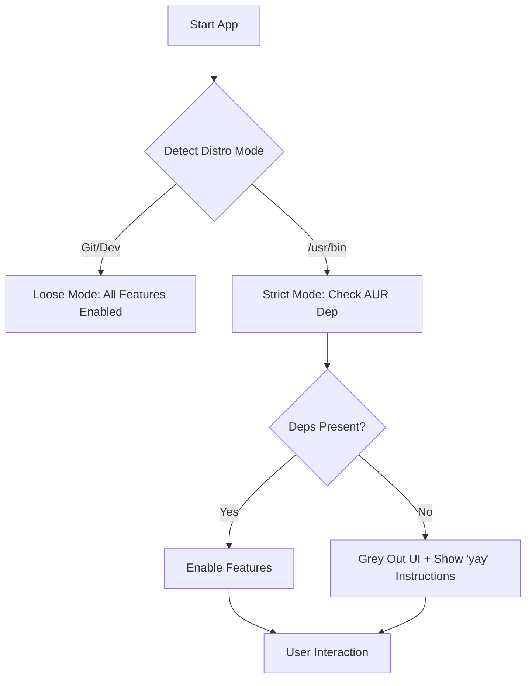

# Masterplan: AUR Integration and Binary Distribution

## 1. Distribution Modes
The application will detect its execution context to determine which guardrails to apply.

### Detection Logic
- **Source/Git Mode (Loose)**: 
    - Detected by the presence of a `.git` directory in the current working directory OR an environment variable `GOATD_DEV=1`.
    - Behavior: Allow feature use even if dependencies are missing (useful for development/debugging).
- **AUR/Package Mode (Strict)**:
    - Detected if the binary is located in `/usr/bin/goatdkernel`.
    - Behavior: Passively check for dependencies and block UI features if they are not present.

## 2. Passive AUR Dependency Checker
Instead of attempting to install packages, the app will check for their presence.

### Dependencies to Check
- **`modprobed-db`**: Check for existence of `/usr/bin/modprobed-db`.
- **`scx-scheds`** (or `scx-scheds-git`): Check for existence of SCX binaries (e.g., `/usr/bin/scx_bpfland`).
- **`polly`**: Check for `polly` (AUR) headers/libs or specific version of `llvm` if applicable. *Correction*: Check for `/usr/lib/libPolly.so` or `/usr/include/polly/`.

### Implementation
- A new `DependencyManager` or enhancements to `HealthManager` will perform these checks on startup and cache the results in `UIState`.

## 3. UI Architecture: Blocking & Instructions
UI elements tied to missing dependencies will be disabled with clear feedback.

### UI Blocking Strategy
- **SCX Kernel Manager Tab**: If `scx-scheds` is missing, the entire "Permanent Scheduler Configuration" group will be greyed out.
- **Modprobed Toggle**: If `modprobed-db` is missing, the "Use modprobed-db" checkbox will be disabled.
- **Polly Toggle**: If `polly` is missing, the "Polly LLVM Vectorization" checkbox will be disabled.

### Instruction Overlays / Tooltips
- When a user hovers over a disabled element, a tooltip will appear:
    - "This feature requires [Package Name]. Please install it from the AUR."
    - Example command: `yay -S modprobed-db`
- A "Missing Dependencies" warning banner may be shown on the Dashboard if any strictly required packages for enabled features are missing.

## 4. AUR Packaging Plan

### `goatdkernel` (Source Package)
- **Repo**: Clones from GitHub.
- **Build**: Uses `cargo` to build the binary.
- **Install**:
    - Binary: `/usr/bin/goatdkernel`
    - Desktop Entry: `/usr/share/applications/goatdkernel.desktop`
    - Icon: `/usr/share/pixmaps/goatdkernel.png`
    - Polkit Policy: `/usr/share/polkit-1/actions/com.goatd.kernel.policy`
- **Dependencies**: `base-devel`, `rust`, `git`, `pkgconf`.

### `goatdkernel-bin` (Binary Package)
- **Source**: Downloads pre-built binary from GitHub Releases (e.g., `goatdkernel-x86_64.tar.gz`).
- **Install**: Same as above, but skips the build step.
- **Dependencies**: Runtime libraries only (`gcc-libs`, `glibc`, `openssl`).

### User/Maintainer Requirements
- **AUR Account**: Required to push to `aur.archlinux.org`.
- **SSH Keys**: Confirmed and added to AUR account for Git access.
- **Binary Hosting**: GitHub Actions will be configured to build and upload release artifacts to GitHub Releases on tag push.

## 5. Implementation Roadmap

### Phase 1: Core Logic (Architect/Code)
1. Implement `DistributionMode` detection in `src/main.rs`.
2. Expand `HealthManager` to perform passive AUR package checks.
3. Update `UIState` to hold `DependencyStatus` for each feature.

### Phase 2: UI Implementation (Code)
1. Modify `src/ui/kernels.rs` to grey out SCX controls based on dependency status.
2. Modify `src/ui/build.rs` to grey out Modprobed and Polly controls.
3. Implement the `yay -S` instruction tooltips/overlays.

### Phase 3: Packaging (Code/DevOps)
1. Create `PKGBUILD` for `goatdkernel`.
2. Create `PKGBUILD` for `goatdkernel-bin`.
3. Set up GitHub Action for automated binary releases.

## 6. Mermaid Workflow Diagram

