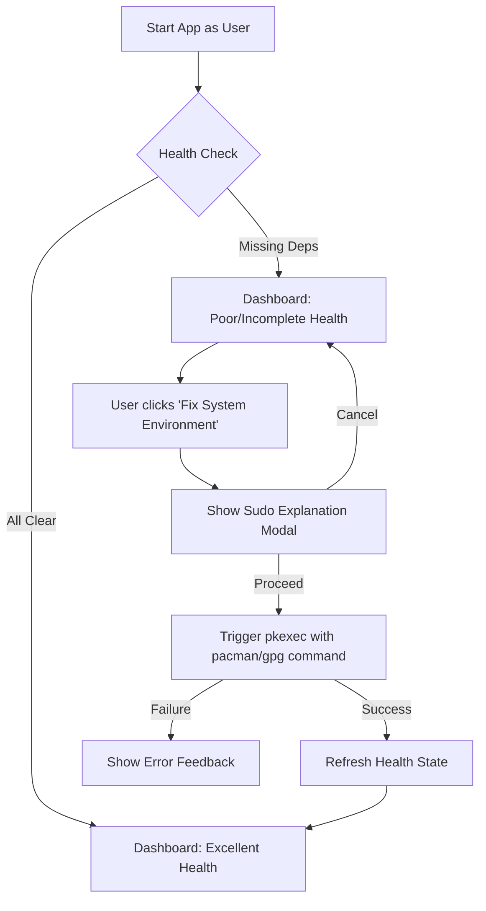

# Plan: First-Run Experience Improvement

This plan outlines the migration of SCX dependencies to official repositories and the implementation of a "sudo-less" startup with informative privilege escalation.

## 1. Dependency Migration (AUR to Official)

### Arch Linux Repositories
- Move `scx-tools` and `scx-scheds` from AUR-only status to official Arch 'extra' repository status in the codebase.

### Affected Files
- `src/system/health.rs`:
    - Add `scx-tools` and `scx-scheds` to the `critical_packages` or `optional_tools` list.
    - Ensure they are NOT in the `aur_packages` set.
    - Result: `HealthManager::generate_fix_command` will include them in the `pacman -S` string.
- `src/system/scx.rs`:
    - Update `provision_scx_environment` to remove AUR-specific guidance for `scx-scheds`.
    - Update log messages to reflect official package status.
- `goatdkernel.sh`:
    - Add `scx-tools` and `scx-scheds` to the `required_packages` list.
    - Remove `sudo` from the automatic installation check; instead, print a warning and advise the user to use the GUI's fix mechanism.

## 2. Sudo-less Startup & Informative UX

### Goal
The application should start without requesting root privileges. It should only ask for `pkexec` when the user explicitly triggers a system fix, and only after an explanation of why it is needed.

### Implementation Strategy
- **State Management**:
    - Add `show_sudo_modal: bool` to `AppState`.
    - Add `pending_fix_command: String` to `AppState`.
- **UI Update (`src/ui/dashboard.rs`)**:
    - "Fix System Environment" button now sets `show_sudo_modal = true` instead of immediately executing.
    - Implement a modal dialog that:
        - Explains that `pacman` and `gpg` operations require privilege.
        - Shows the exact command that will be executed.
        - Provides "Proceed" (triggers `pkexec`) and "Cancel" buttons.
- **Polkit Policy**:
    - Verify `assets/com.goatd.kernel.policy` allows the necessary operations via `pkexec`.

## 3. Test Audit & Updates

### Impacted Tests
- `src/system/health.rs` internal tests: Update assertions for package counts and types.
- `src/system/scx.rs` internal tests: Update provisioning logic tests.
- `tests/integration_tests.rs`: Ensure `scx_available` in `create_test_config` matches the new detection logic.
- `tests/startup_verification.rs`: Verify no regressions in profile-aware defaults.

## 4. Mermaid Flowchart

