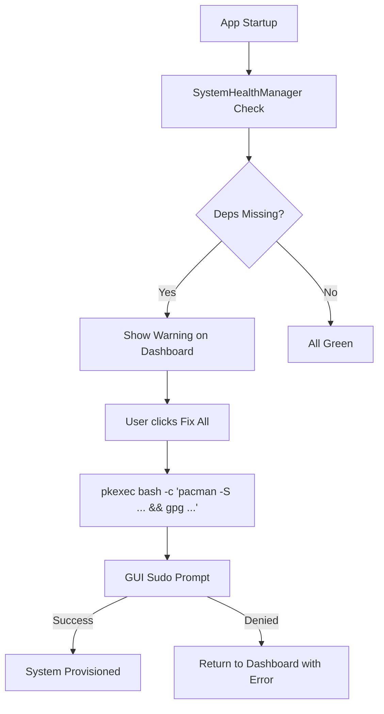

# Technical Plan: GUI Dependency Management, SCX Fix, and Native Defaults

## 1. SCX Provisioning Fix
**Problem**: The current atomic provisioning chain in [`src/system/scx.rs`](src/system/scx.rs:434) fails because it attempts to install `scx-scheds` via `pacman -S`, which is often an AUR package. Additionally, `scx_loader.service` may not be the correct service name in all package versions.

**Proposed Changes**:
- **Diagnostic Phase**: Add a check to see if `scx-scheds` or `scx-scheds-git` is already installed via `pacman -Qq`.
- **Service Name Normalization**: Check for both `scx_loader.service` and `scx.service`.
- **Improved Provisioning**:
    - If `scx-scheds` is missing, tell the user to install it via their AUR helper (since `pacman -S` won't work).
    - If the package *is* installed but the service is missing, fix the `mkdir` and `cp` logic to ensure `/etc/scx_loader/` is properly initialized.
    - Update [`provision_scx_environment`](src/system/scx.rs:434) to handle the case where the service file is already provided by the package but needs to be enabled.

## 2. Native Optimization Defaults
**Problem**: `march=native` is not consistently defaulted to 'on' across the UI and config layers.

**Proposed Changes**:
- **UI State**: Update [`UIState::default()`](src/ui/app.rs:217) to set `native_optimizations: true`.
- **Profile Definition**: Add `native_optimizations` to [`ProfileDefinition`](src/config/profiles.rs:72) and set it to `true` for all standard profiles (Gaming, Workstation, Laptop, etc.).
- **Finalizer Integration**: Update [`finalize_kernel_config`](src/config/finalizer.rs:81) to apply the profile's `native_optimizations` default to the `KernelConfig`.

## 3. GUI Dependency Management
**Goal**: Move away from terminal `sudo` prompts at startup. Use a background check and a GUI-based "Fix" flow.

**Architecture**:
- **Background Checker**: Create a `SystemHealthManager` that performs non-intrusive checks for:
    - Missing packages: `pacman -Qq rust base-devel git bc rust-bindgen rust-src graphviz python-sphinx texlive-latexextra llvm clang lld polly`
    - GPG Keys: Check if fingerprints `38DBBDC86092693E` and `B8AC08600F108CDF` are in the user's keyring.
    - `modprobed-db`: Check if the binary is present.
- **UI Component**:
    - Add a "System Health" section to [`src/ui/dashboard.rs`](src/ui/dashboard.rs).
    - Show a warning icon if any dependency is missing.
    - Provide an "Install Dependencies" or "Fix System" button.
- **Privileged Installation**:
    - When "Fix" is clicked, trigger a `pkexec bash -c "..."` command.
    - This command will chain `pacman -S --needed`, GPG key imports, and `modprobed-db` initialization.
    - This results in a single GUI sudo prompt via PolicyKit.

## 4. AUR Strategy & Launcher Simplification
**Goal**: Prepare for distribution where the app is already installed in `/usr/bin/`.

**Proposed Changes**:
- **Launcher Script**: Simplify [`goatdkernel.sh`](goatdkernel.sh) to:
    1. Check if `goatd_kernel` is in `PATH` (system install).
    2. If not, check `target/release/goatd_kernel` (dev install).
    3. Launch the binary directly.
- **Relocation of Setup**: Move the logic from `check_dependencies` in `goatdkernel.sh` into the Rust app's `SystemHealthManager`.

## 5. Implementation Roadmap
1.  **Phase 1: Config & UI Defaults**
    - Update `profiles.rs` and `app.rs` to default `march=native` to `true`.
    - Verify `finalizer.rs` respects this default.
2.  **Phase 2: System Health Logic**
    - Create `src/system/health.rs` with dependency check logic.
    - Integrate check results into [`AppController`](src/ui/controller.rs).
3.  **Phase 3: GUI Implementation**
    - Add "System Health" widget to Dashboard.
    - Implement the `pkexec` installation flow.
4.  **Phase 4: SCX Fixes**
    - Refactor `src/system/scx.rs` provisioning to be more robust.
5.  **Phase 5: Launcher Cleanup**
    - Strip heavy dependency logic from `goatdkernel.sh`.

## Mermaid Diagram: GUI Sudo Flow

